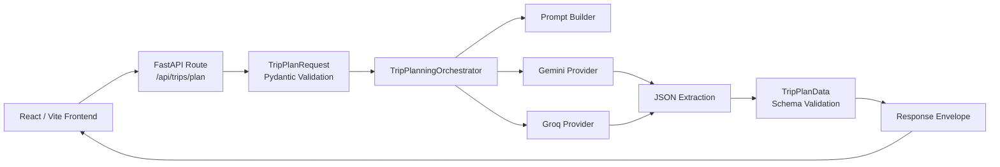

# AI Trip Planner

Welcome to the AI Trip Planner - a cutting-edge application designed to revolutionize the way you plan your trips! Powered by the latest advancements in AI through Gemini's APIs, this React application offers personalized trip recommendations, catering to a wide range of preferences including destination, duration, trip type, and budget.

## Features

- **Personalized Trip Recommendations**: Get AI-driven suggestions tailored to your unique travel preferences.
- **Interactive UI**: A user-friendly interface, optimized for mobile devices, making trip planning easy and fun.
- **Dynamic Itineraries**: Generate custom itineraries based on the number of days, interests, and budget.
- **Adventure Awaits**: From adrenaline-pumping adventures to romantic getaways, find trips that suit your mood and interests.

## Getting Started

### Prerequisites

Before you embark on your journey with AI Trip Planner, make sure you have the following installed:
- Node.js (LTS version recommended)
- A package manager (npm or yarn)

### Installation

1. **Clone the Repository**
    ```bash
    git clone "repo link"
    cd ai-trip-planner
    ```

2. **Install Dependencies**
    ```bash
    npm install
    # or if you're using yarn
    yarn install
    ```

3. **Set up the backend**
    ```bash
    python3 -m venv .venv
    . .venv/bin/activate
    pip install -r backend/requirements.txt
    ```

4. **Configure environment variables**
    ```bash
    cp .env.example .env
    ```
    Then add either `GEMINI_API_KEY`, `GROQ_API_KEY`, or both for automatic fallback.

5. **Start the backend**
    ```bash
    . .venv/bin/activate
    cd backend
    uvicorn app.main:app --reload
    ```

6. **Start the frontend**
    ```bash
    npm run dev
    # or
    yarn dev
    ```

7. **Open [http://localhost:5173](http://localhost:5173) in your browser**, and you're ready to plan your next trip!

## Backend Architecture

- `backend/app/api/routes/trips.py` exposes trip-planning endpoints.
- `backend/app/services/orchestrator.py` handles request validation, prompt assembly, provider fallback, and response validation.
- `backend/app/services/providers/` contains provider adapters for Gemini and Groq.
- The frontend now calls the backend instead of using browser-side AI SDKs directly.



### Backend Flow

1. The frontend sends trip input to `POST /api/trips/plan`.
2. FastAPI validates the payload with `TripPlanRequest`.
3. The orchestrator builds a structured prompt and tries the configured providers in order.
4. The provider response is parsed into JSON and validated against `TripPlanData`.
5. The backend returns a consistent response envelope with `data`, `error`, and `meta`.

### Backend File Guide

#### `backend/app/main.py`

- `create_app()`: creates the FastAPI app, loads settings, attaches CORS, and registers routes.
- `healthcheck()`: lightweight health endpoint used for uptime and deployment checks.
- `app`: exported ASGI application used by Uvicorn.

#### `backend/app/core/config.py`

- `_split_csv()`: converts comma-separated env values like `CORS_ORIGINS` into Python lists.
- `Settings`: central config object for API keys, provider order, model names, timeout, and CORS.
- `Settings.__post_init__()`: fills derived/default values after the dataclass is created.
- `Settings.provider_order`: returns the ordered list of unique providers to try.
- `get_settings()`: loads and caches environment-driven settings.

#### `backend/app/dependencies.py`

- `get_settings()`: dependency wrapper for config access.
- `get_orchestrator()`: builds and caches the orchestrator with the currently enabled providers.

#### `backend/app/api/routes/trips.py`

- `plan_trip()`: main API endpoint that receives trip input and returns itinerary results.
- `list_configured_providers()`: debug endpoint showing which providers are loaded.
- `router`: route collection mounted into the FastAPI app.

#### `backend/app/schemas/trips.py`

- `Activity`: schema for one itinerary activity.
- `DayPlan`: schema for one day of the itinerary.
- `TripPlanData`: schema for the full itinerary payload.
- `TripPlanMeta`: metadata like request ID, provider, model, and attempted providers.
- `TripPlanRequest`: validated request body coming from the frontend.
- `TripPlanRequest.normalize_text()`: trims and validates text inputs.
- `TripPlanResponseEnvelope`: common API response shape.
- `PlannedTripResult`: internal success result passed from services to routes.

#### `backend/app/services/prompts.py`

- `SYSTEM_INSTRUCTION`: system message given to the model.
- `build_trip_prompt()`: creates the user prompt from validated trip input and embeds the JSON schema.

#### `backend/app/services/orchestrator.py`

- `TripPlanningError`: app-level error class with safe user-facing message, status code, and metadata.
- `TripPlanningOrchestrator`: core service that coordinates provider calls and validation.
- `TripPlanningOrchestrator.provider_names`: returns the active provider names.
- `TripPlanningOrchestrator.plan_trip()`: builds the prompt, tries providers in order, validates output, and applies fallback behavior.

#### `backend/app/services/providers/base.py`

- `ProviderError`: signals upstream provider or parsing failures.
- `AIProvider`: abstract base class that all model providers implement.
- `AIProvider.generate_itinerary()`: required interface for provider-specific generation.

#### `backend/app/services/providers/factory.py`

- `build_provider_chain()`: creates the list of enabled providers based on env config and available API keys.

#### `backend/app/services/providers/gemini.py`

- `GeminiProvider.__init__()`: initializes the Gemini adapter.
- `GeminiProvider.generate_itinerary()`: sends the request to Gemini, extracts text, and returns parsed JSON.

#### `backend/app/services/providers/groq.py`

- `GroqProvider.__init__()`: initializes the Groq adapter.
- `GroqProvider.generate_itinerary()`: sends the request to Groq, extracts assistant content, and returns parsed JSON.

#### `backend/app/services/providers/utils.py`

- `extract_json_object()`: strips code fences, tries direct JSON parsing, and falls back to extracting the first valid JSON object from model output.

#### `backend/tests/test_api.py`

- `StubOrchestrator`: fake orchestrator used for route testing.
- `test_plan_trip_endpoint_returns_envelope()`: verifies the API route returns the expected response shape.

#### `backend/tests/test_orchestrator.py`

- `FakeProvider`: fake provider used to simulate success and failure cases.
- `test_orchestrator_falls_back_to_secondary_provider()`: verifies fallback behavior.
- `test_orchestrator_raises_when_no_provider_succeeds()`: verifies failure handling after all providers fail.

#### `backend/tests/test_prompts.py`

- `test_build_trip_prompt_includes_normalized_fields()`: verifies prompt generation includes the expected request values.

## Deploying the Backend on Render

The repo now includes a root-level `render.yaml` for deploying the FastAPI backend as a Render web service.

1. Create a new Render Blueprint or Web Service from this repo.
2. Use the generated service with the included settings:
   - Build command: `pip install -r backend/requirements.txt`
   - Start command: `cd backend && uvicorn app.main:app --host 0.0.0.0 --port $PORT`
   - Health check path: `/health`
3. Set backend environment variables in Render:
   - `CORS_ORIGINS=https://wanderlust-plum-eight.vercel.app`
   - `GEMINI_API_KEY=...` and/or `GROQ_API_KEY=...`
   - Optional: `PRIMARY_PROVIDER`, `FALLBACK_PROVIDER`, `REQUEST_TIMEOUT_S`
4. After Render assigns a URL like `https://your-service.onrender.com`, add this environment variable in Vercel for the frontend:
   - `VITE_API_BASE_URL=https://your-service.onrender.com`
5. Redeploy the frontend on Vercel.

### Manual Smoke Test

Once the Render service is live:

```bash
curl https://your-service.onrender.com/health
curl https://your-service.onrender.com/api/trips/providers
curl -X POST https://your-service.onrender.com/api/trips/plan \
  -H "Content-Type: application/json" \
  -d '{"destination":"Bangkok","number_of_days":3,"trip_start":"2026-04-10","itinerary_type":"Adventure","budget":"Medium"}'
```

## How to Use

- **Step 1**: Enter your trip details, including destination, start date, trip type, and budget.
- **Step 2**: Hit the "Plan My Trip" button.
- **Step 3**: Explore a variety of AI-generated trip recommendations and itineraries.

## Contributing

I welcome contributions of all kinds from the community! Whether it's a new feature, bug fix, or improvement to our documentation, please feel free to fork the repository and submit a pull request.
