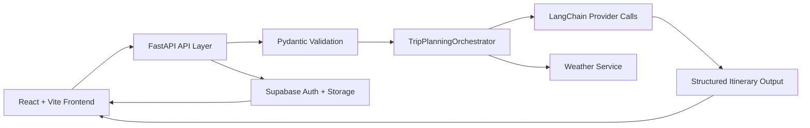

# Wanderlust

Wanderlust is an AI-powered trip planning application that turns a simple travel brief into a structured itinerary, lets users refine it through chat, and saves versioned trips to their account for later review and editing.

The project combines a Vite + React frontend with a FastAPI backend, LangChain-powered itinerary orchestration, weather enrichment, Supabase authentication, and persistent saved-trip history.

## Highlights

- AI itinerary generation with structured day-by-day output
- Chat-based itinerary editing for both draft and saved trips
- Weather-aware planning with forecast context in the trip workflow
- Supabase authentication with Google OAuth and magic-link email login
- Saved itineraries with version history, preview, restore, and delete flows
- Backend idempotency support for safer save operations
- Route-level code-splitting and skeleton loading states for smoother UX

## Product Flow

1. A user enters destination, trip length, dates, trip style, and budget.
2. The backend generates a structured itinerary using the configured AI provider.
3. The user can refine the itinerary through chat-based edits.
4. If signed in, the itinerary can be saved to Supabase and reopened later.
5. Saved itineraries support message history, version preview, and append-only restore.

## Tech Stack

### Frontend

- React 18
- Vite
- React Router
- Supabase JS client

### Backend

- FastAPI
- Pydantic
- LangChain
- Gemini and Groq provider adapters
- Supabase-backed persistence and auth verification

### Infrastructure

- Supabase for auth and storage
- Render-ready FastAPI deployment via `render.yaml`
- Vercel-friendly frontend environment setup

## Core Features

### AI Planning

- `POST /api/trips/plan` generates a structured itinerary from validated trip inputs.
- The backend orchestrator handles provider fallback and consistent response envelopes.

### Chat Editing

- Draft itineraries can be edited statelessly through `POST /api/trips/edit`.
- Saved itineraries can be edited persistently through `POST /api/itineraries/:id/edit`.

### Weather Support

- `GET /api/trips/weather` provides normalized weather data for the trip window.
- The itinerary screen surfaces forecast context in a dedicated weather panel.

### Saved Trips

- Save drafts after sign-in with auto-save recovery after auth redirects.
- View saved itineraries in a dedicated dashboard.
- Open a saved trip, inspect version history, preview older versions, and restore them as new latest versions.

### Auth

- Supabase Google OAuth
- Supabase email OTP / magic link
- Account-scoped saved-trip access with row-level security in Supabase

## Architecture



## Repository Structure

```text
.
├── src/                 # Frontend application
├── backend/             # FastAPI backend
├── supabase/            # Database schema and RLS setup
├── render.yaml          # Render deployment config
├── .env.example         # Frontend env template
└── backend/.env.example # Backend env template
```

## API Surface

### Trip APIs

- `POST /api/trips/plan`
- `POST /api/trips/edit`
- `GET /api/trips/weather`
- `GET /api/trips/providers`

### Saved Itinerary APIs

- `POST /api/itineraries`
- `GET /api/itineraries`
- `GET /api/itineraries/:id`
- `POST /api/itineraries/:id/edit`
- `GET /api/itineraries/:id/versions/:versionNumber`
- `POST /api/itineraries/:id/versions/:versionNumber/restore`
- `DELETE /api/itineraries/:id`

## Local Setup

### Prerequisites

- Node.js 18+
- Python 3.13 recommended for the backend venv
- npm

### 1. Install frontend dependencies

```bash
npm install
```

### 2. Create the backend virtual environment

```bash
python3 -m venv .venv313
. .venv313/bin/activate
pip install -r backend/requirements.txt
```

### 3. Configure environment variables

Frontend variables live in `.env` and backend variables live in `backend/.env`.

Use:

- `/.env.example`
- `/backend/.env.example`

Minimum expected values:

```env
# Frontend
VITE_API_BASE_URL=http://localhost:8000
VITE_SUPABASE_URL=https://your-project-ref.supabase.co
VITE_SUPABASE_ANON_KEY=sb_publishable_your_public_key
```

```env
# Backend
CORS_ORIGINS=http://localhost:5173
SUPABASE_URL=https://your-project-ref.supabase.co
SUPABASE_ANON_KEY=sb_publishable_your_public_key
GEMINI_API_KEY=
GROQ_API_KEY=
PRIMARY_PROVIDER=gemini
FALLBACK_PROVIDER=groq
LOG_LEVEL=INFO
LOG_FILE_PATH=./logs/backend.log
```

## Supabase Setup

1. Create a Supabase project.
2. Configure Auth providers:
   - Google OAuth
   - Email OTP / magic link if desired
3. Set `Site URL` and `Redirect URLs` in Supabase Auth.
4. Run the SQL in `supabase/schema.sql`.

Important:

- Re-run `supabase/schema.sql` after pulling the latest changes so the `client_request_id` column and unique index are present.

## Running the App

### Start the backend

```bash
. .venv313/bin/activate
cd backend
uvicorn app.main:app --reload
```

### Start the frontend

```bash
npm run dev
```

Open [http://localhost:5173](http://localhost:5173).

## Testing and Verification

### Frontend

```bash
npm run lint
npm run build
```

### Backend

```bash
cd backend
../.venv313/bin/python -m pytest tests -q
```

## Deployment Notes

### Frontend

- Deployable to Vercel or any static host
- Set `VITE_API_BASE_URL` to the deployed backend URL

### Backend

- Deployable to Render using `render.yaml`
- Exposes `/health` for uptime checks

Render start command:

```bash
pip install -r backend/requirements.txt
cd backend && uvicorn app.main:app --host 0.0.0.0 --port $PORT
```

## Current UX / Engineering Work Completed

- Route-level code-splitting for major screens
- Lazy-loaded Supabase auth client
- Structured backend logging with optional file output
- Page-level and inline skeleton loading states
- Route-level error boundary for frontend crash handling
- Single-panel support tabs for weather, versions, and edit logs

## Future Improvements

- Optimize large image assets for faster first paint
- Add toast feedback for save, restore, and delete actions
- Add richer diff views between itinerary versions
- Add more external tools such as flights and hotels when backend scope expands

## Backend Reference

Backend-specific deployment and environment details are documented in `backend/README.md`.
