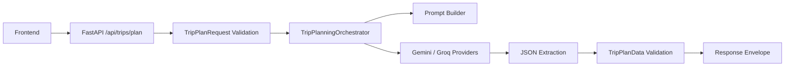

# Backend Deployment

This FastAPI service is intended to be deployed as a standalone Render web service while the frontend remains on Vercel.

## Architecture



## File Guide

- `app/main.py`: FastAPI app creation, CORS setup, and `/health`.
- `app/core/config.py`: environment config loading and provider order logic.
- `app/dependencies.py`: cached dependency wiring for settings and orchestrator.
- `app/api/routes/trips.py`: trip planning and provider inspection endpoints.
- `app/schemas/trips.py`: request, response, itinerary, and metadata schemas.
- `app/services/prompts.py`: system prompt and prompt construction.
- `app/services/orchestrator.py`: provider fallback, response validation, and error handling.
- `app/services/providers/`: Gemini and Groq integrations plus shared provider helpers.
- `tests/`: API, orchestrator, and prompt tests.

## Required Environment Variables

- `CORS_ORIGINS=http://localhost:5173` for local development
- `SUPABASE_URL=...`
- `SUPABASE_ANON_KEY=...`
- `GEMINI_API_KEY=...` and/or `GROQ_API_KEY=...`

## Optional Environment Variables

- `PRIMARY_PROVIDER=gemini`
- `FALLBACK_PROVIDER=groq`
- `REQUEST_TIMEOUT_S=35`
- `GEMINI_MODEL=gemini-2.5-flash`
- `GROQ_MODEL=openai/gpt-oss-120b`
- `LOG_LEVEL=INFO`
- `LOG_FILE_PATH=./logs/backend.log`

For the frontend, copy [/.env.example](/Users/vaishnavverma/Downloads/wanderlust/.env.example) and set:

- `VITE_API_BASE_URL=http://localhost:8000`
- `VITE_SUPABASE_URL=...`
- `VITE_SUPABASE_ANON_KEY=...`

For Supabase keys, prefer the newer publishable key (`sb_publishable_...`). A legacy `anon` key still works for this app because it uses the public client flow, but publishable is the current recommended option.

## Local Run

```bash
python3 -m venv .venv
. .venv/bin/activate
pip install -r backend/requirements.txt
cd backend
uvicorn app.main:app --reload
```

## Render Run

The root-level [render.yaml](/Users/vaishnavverma/.codex/worktrees/4920/wanderlust/render.yaml) deploys this backend with:

```bash
pip install -r backend/requirements.txt
cd backend && uvicorn app.main:app --host 0.0.0.0 --port $PORT
```

## Smoke Checks

- `GET /health`
- `GET /api/trips/providers`
- `POST /api/trips/plan`
